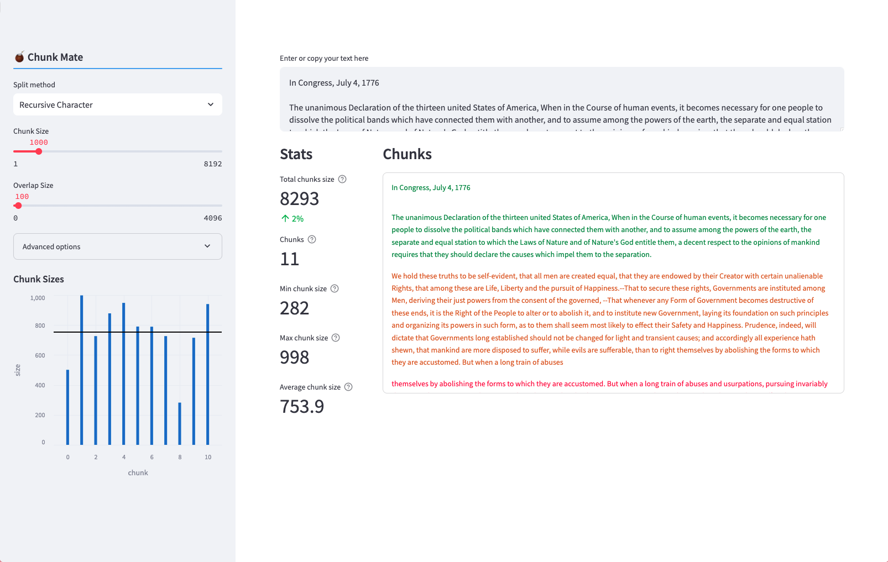

# ChunkMate

**ChunkMate** is an interactive application designed to help users experiment with various chunking techniques for Retrieval Augmented Generation (RAG). It enables users to analyze and split texts into chunks using different splitting methods and adjust parameters to optimize chunk sizes for specific use cases in text processing, retrieval, and natural language generation.



[Online demo (Streamlit Coud)](https://chunkmate.streamlit.app/)

## Features

- **Split Methods**: Users can select from various split methods to create chunks, such as:
  - **Character**: Splits text based on character count.
  - **Semantic**: Creates chunks based on the semantic meaning of the content.
  - **Recursive Character**: Utilizes recursive splitting based on character limits for better handling of text boundaries.

- **Adjustable Parameters**: Fine-tune chunking by adjusting:
  - **Chunk Size**: Define the maximum size of each chunk.
  - **Overlap Size**: Specify overlap between consecutive chunks.
  - **Breakpoint Threshold Type and Amount**: For semantic splitting, control how text is split based on breakpoints like percentiles, standard deviation, interquartile, or gradient.

- **Chunk Visualization**: Chunks are shown in the original text using different colors
- **Stats and Visual Feedback**: Real-time updates on statistics like:
  - **Total Chunk Size**
  - **Number of Chunks**
  - **Minimum, Maximum, and Average Chunk Sizes**

  Visual bar graphs help analyze the distribution of chunk sizes for better optimization.

- **Text Input**: Users can input or copy their text directly into the application for chunking and analysis.

## Getting Started

To start using ChunkMate, enter or paste your text into the input field. Then, choose your preferred chunking method from the split options, and adjust the parameters as needed. You can visually inspect the chunks and use the statistics panel to understand how the text is being split.

### Use Cases

- **Retrieval Augmented Generation (RAG)**: Optimize chunk sizes for text retrieval and augmentation in NLP models.
- **Text Processing**: Use the chunking techniques for handling large bodies of text in search, summarization, or indexing tasks.
- **Experimentation and Tuning**: Test different splitting approaches to find the optimal method for specific text analysis requirements.

## Usage

To run ChunkMate locally or deploy it to the Streamlit cloud, you'll need to set up a Streamlit environment.

### Installing Streamlit Locally

1. **Install Python**: Make sure you have Python installed on your machine. You can download Python from the [official website](https://www.python.org/).

2. **Set Up a Virtual Environment (optional)**: It is recommended to create a virtual environment for your project.
   ```bash
   python3 -m venv env
   source env/bin/activate  # On Windows, use `env\Scripts\activate`
   ```

3. **Install Streamlit**: Use `pip` to install Streamlit.
   ```bash
   pip install streamlit
   ```
4. **Clone repository**:
```bash
git clone git@github.com:feder1402/chunk_mate.git
``` 

5. **Run the Streamlit App**: Navigate to your project directory and run the app using Streamlit.
   ```bash
   streamlit run app.py
   ```
   Replace `app.py` with the name of your Python script containing the ChunkMate code.

6. **Access the App**: Once the app is running, it will be accessible in your browser at `http://localhost:8501`.

### Deploying to Streamlit Cloud

1. **Create a Streamlit Cloud Account**: Sign up or log in to [Streamlit Cloud](https://share.streamlit.io/).

2. **Fork repository**:

3. **Link Your GitHub Repository**: Connect your GitHub account to Streamlit Cloud and link the repository that contains your ChunkMate code.

4. **Deploy the App**: Select the repository and branch where your code resides, and deploy it. Streamlit Cloud will automatically build and serve your application.

5. **Access the App Online**: Once deployed, your app will have a live URL provided by Streamlit Cloud, making it easy to share and use from any device.

## Additional Configuration

- **Advanced Options**: Customize how the text is separated using delimiters or stripping whitespace to adjust chunk sizes.
- **Visualization**: Use the histogram to analyze the distribution of chunk sizes for better insights into your text chunking strategy.

## Feedback and Contribution

If you have suggestions or want to contribute to improving ChunkMate, please feel free to open issues or submit pull requests in the repository. User feedback is valuable for enhancing the functionality and user experience of the application.

---

Happy chunking with ChunkMate! Optimize your text processing for improved retrieval and generation results.

## Credits
Heavily inspired by [Greg Kamradt](https://x.com/GregKamradt)'s [Five levels of text Splitting](https://www.youtube.com/watch?v=8OJC21T2SL4) and accompanying online tool [ChunkViz](https://chunkviz.up.railway.app/).

ChunkMate was made with [Streamlit](https://streamlit.io/) and [LangChain](https://python.langchain.com).